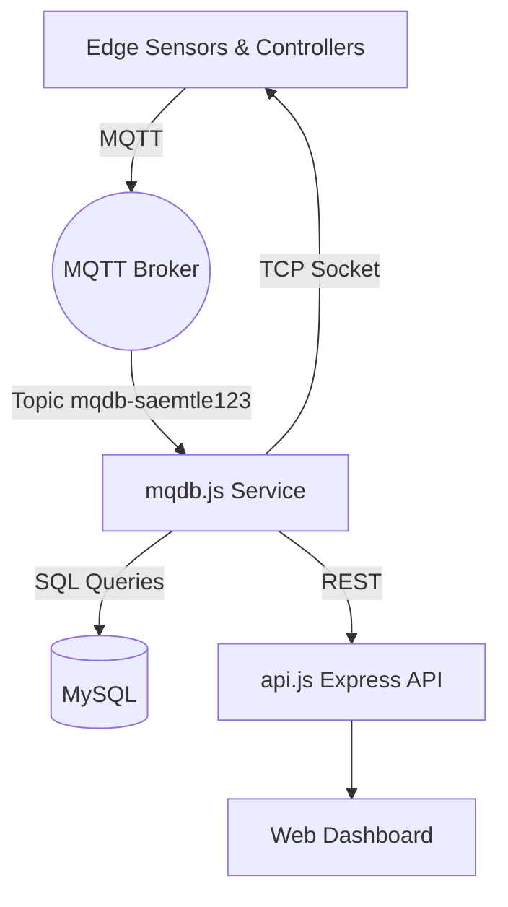

# Saemtle Airple Monitoring Platform

Saemtle Airple is an end-to-end IoT solution that monitors rural reservoirs and ambient air quality. It combines embedded devices, MQTT messaging, Node.js services, and a responsive web dashboard to deliver real-time visibility and remote control for field engineers and municipal teams.

## Overview

- **Purpose**: Provide continuous telemetry, alerts, and manual controls for reservoir infrastructure and environmental sensors.
- **Stack**: Node.js, MySQL, MQTT, static web dashboard (HTML/CSS/JS), AWS EC2 deployment.
- **Protocols**: MQTT for device messaging, TCP sockets for firmware uploads, REST APIs for external consumers.
- **Scope**: Back-end services in `ubuntu/mqdb`, front-end assets in `test/dist`, automation scripts and templates in `test/src`.

## Architecture

1. **Edge Devices**
   - Publish sensor data (water level, temperature, voltage, airflow) over MQTT to the central broker.
   - Support image capture requests via TCP socket sessions.
2. **MQTT Ingestion (`ubuntu/mqdb/mqdb.js`)**
   - Subscribes to `mqdb-saemtle123`.
   - Persists telemetry and device state to MySQL (`sensordt`, `reservoir`, `users` tables).
   - Manages actuator commands, capture requests, and download jobs.
3. **REST API (`ubuntu/mqdb/api.js`)**
   - Exposes lightweight endpoints (e.g., `/api/sensordata`) for dashboards or third-party integrations.
4. **Database (`saemtleDb.sql`)**
   - Stores device registry, user accounts, reservoir metadata, and sensor history.
5. **Web Dashboard (`test/dist`)**
   - Static front-end bundled with Bootstrap and custom scripts for live charts, tables, and map overlays.



## Key Features

- **Real-time Telemetry**: Persist and visualize reservoir levels, voltages, temperatures, airflow metrics.
- **Remote Actuation**: Update reservoir actuators (`act1open`) and configuration flags over MQTT/TCP.
- **Image Capture Pipeline**: Trigger photo uploads, receive base64 payloads, and archive on the server.
- **Role-Based Access**: Manage users with multiple privilege tiers (field operator, manager, super admin).
- **Data Export**: Retrieve historical sensor data for reporting and compliance.

## Directory Structure

```
.
├── README.md
├── saemtleDb.sql                 # Database schema and seed data
├── ubuntu/mqdb/                  # Node.js services
│   ├── api.js                    # Express API endpoints
│   ├── dbControl.js              # MySQL connection pool (mysql2/promise)
│   ├── mqdb.js                   # MQTT/TCP ingestion and command processor
│   └── package.json              # Service dependencies and scripts
├── test/                         # Front-end build pipeline (startbootstrap)
│   ├── dist/                     # Production-ready static dashboard
│   ├── src/                      # Pug, SCSS, JS sources
│   └── scripts/                  # Asset build tooling
└── security/                     # SSH keys and IDS (do not version sensitive secrets)
```

## Getting Started

### Prerequisites

- Node.js 18+
- MySQL 8 (or compatible MariaDB)
- MQTT broker (e.g., Eclipse Mosquitto)
- AWS EC2 (or any Linux host) for deployment

### Local Setup

1. **Clone & Install**

   ```bash
   git clone <repo-url>
   cd saemtle_airple/ubuntu/mqdb
   npm install
   ```

2. **Configure Environment**

   Create `ubuntu/mqdb/.env`:

   ```
   DB_HOST=<mysql-host>
   DB_USER=<mysql-user>
   DB_PASSWORD=<mysql-password>
   DB_NAME=saemtleDb
   MQTT_HOST=mqtt://<broker-host>
   MQTT_TOPIC=mqdb-saemtle123
   TCP_PORT=23579
   ```

   Update `dbControl.js` and `mqdb.js` to load from `.env` (e.g., with `dotenv`). Avoid committing plaintext credentials.

3. **Run Services**

   ```bash
   # REST API
   node api.js

   # MQTT/TCP ingestion
   node mqdb.js
   ```

4. **Serve Dashboard**

   ```bash
   cd ../../test
   npm install
   npm run build       # build static assets into dist/
   npm run start       # serves Pug templates with live reload
   ```

### Database Initialization

- Import `saemtleDb.sql` into MySQL:

  ```bash
  mysql -u <user> -p < database_name < saemtleDb.sql
  ```

- Grant appropriate privileges to the service account.

## MQTT & TCP Interfaces

- **Topic**: `mqdb-saemtle123`
- **Inbound Commands**: `LOGIN_START`, `GET_RESERVOIR`, `PUT_CAPTURE`, `GET_SENSES`, etc.
- **Outbound Responses**: `LOGIN_START_VALIDATION`, `GET_SENSES_DONE`, `GET_CAPTURE_STATUS`, etc.
- **TCP Socket**: Port `23579` handles base64 image uploads and direct device queries (`RSV_*`, `JPEG_IMG`, `CAPTURE_STATUS`).

Refer to `mqdb.js` for the complete command matrix and data parsing logic.

## REST API Summary

| Method | Endpoint             | Description                        |
| ------ | -------------------- | ---------------------------------- |
| GET    | `/api/users/:type`   | Placeholder endpoint returning `type`. |
| GET    | `/api/sensordata`    | Latest 10 sensor rows (descending). |

Extend `api.js` with additional routes for reservoir metadata, chart data, or alerts as needed.

## Logging & Observability

- `mqdb.js` uses Winston with daily rotate files stored under `log/system.log`.
- Console and file outputs share consistent formatting (`YYYY-MM-DD HH:MM:SS [LEVEL] message`).
- Review log rotation settings before production deployment.

## Security Guidelines

- **Secrets**: Move hard-coded credentials (MySQL, MQTT) into environment variables or secret managers.
- **Network**: Restrict MQTT and TCP ports with AWS Security Groups and local firewalls.
- **TLS**: Enable HTTPS for the dashboard (see `test/000-default.conf` & `test/default-ssl.conf`).
- **User Passwords**: Consider hashing & salting rather than the current XOR-based scheme in `mqdb.js`.

## Testing

- Create integration tests around `mqdb.js` MQTT/TCP handlers using simulated payloads.
- Add REST API tests (e.g., Jest + Supertest) for new routes.
- Front-end smoke tests with Cypress or Playwright ensure charts, maps, and tables render correctly.

## Deployment Checklist

- Build and upload dashboard assets from `test/dist` to the web server root.
- Run `mqdb.js` and `api.js` under a process manager (PM2, systemd) with restart policies.
- Monitor MySQL performance and configure backups for `sensordt` growth.
- Configure MQTT broker authentication and QoS 2 for guaranteed delivery.

## Roadmap Ideas

- Replace TCP image uploads with MQTT binary payloads or HTTP uploads.
- Introduce alerting (SMS/Email) for threshold breaches.
- Expand REST API for analytics dashboards (rolling averages, forecasts).
- Containerize services with Docker Compose for reproducible deployment.

---

Saemtle Airple empowers stakeholders to supervise critical water resources and environmental metrics remotely. Contributions and feedback are welcome—please open issues or submit pull requests with proposed improvements.


